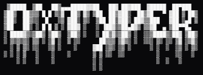

<div align="center">

<br />



**Clipboard history manager for Windows — with a dark hacker aesthetic.**
Copy anything. Find it later. Type it anywhere — even where Ctrl+V doesn't work.

<br />


<br />

> **Add a demo GIF here** — record with [ScreenToGif](https://www.screentogif.com/) and drop it in `/assets/demo.gif`

</div>

---

## What is 0xpaste?

0xpaste is a lightweight clipboard history manager that sits in your Windows system tray and pops up in the corner of your screen with a hotkey. It tracks everything you copy — up to 75 items — and lets you paste them into any text field by either clicking or dragging, using Windows' `SendInput` API to simulate actual keystrokes.

This means it works in places where normal Ctrl+V is blocked — like **remote desktop sessions, VMs, browser-based consoles** (vSphere, iDRAC, etc.), and any app that doesn't handle clipboard paste properly.

---

## Features

| | |
|---|---|
| 📋 **Clipboard history** | Auto-tracks everything you copy. Pinned items float to the top, unpinned are FIFO. |
| ⌨️ **Click to type** | Click an item → click a target field → 0xpaste types it out for you. |
| 🖱️ **Drag to type** | Drag an item directly to any text field on any monitor. |
| 🖥️ **Multi-monitor** | One capture window per display — drop targets work on all screens. |
| 🔍 **Live search** | Instantly filter your history as you type. |
| 📌 **Pin items** | Prevent important items from being rotated out of history. |
| 👁️ **Mask sensitive items** | Toggle the eye icon to hide item content in the preview. |
| ⚙️ **Full settings panel** | Typing speed, initial delay, hotkey, accent color, panel position, history limit. |
| 🎨 **Accent color** | Pick any color — the entire UI updates live. |
| 🚀 **Auto-start** | Optionally runs at Windows startup, always ready in the tray. |

---

## Installation

### Option A — Download the installer *(recommended)*

Head to [**Releases**](https://github.com/mypetcheetah/0xpaste/releases) and grab the latest `.exe`.

> **Note on security warnings:** Because 0xpaste uses the Windows `SendInput` API to simulate keystrokes, some antivirus tools may flag it. This is a false positive — the app only types when you explicitly trigger a paste. Add an exclusion in your security software if needed.

### Option B — Build from source

See [Building from Source](#building-from-source) below.

---

## Usage

Once installed, 0xpaste runs in the system tray. Toggle the panel with the hotkey.

### Hotkey

| Default | Action |
|---------|--------|
| `Ctrl + -` | Open / close the panel |
| `Escape` | Cancel a pending type / drag operation |

> The hotkey is fully configurable in settings. Change it to anything that works for your setup.

### Panel controls

| Action | How |
|--------|-----|
| **Type an item** | Click the card → move to target field → click |
| **Drag an item** | Hold and drag the card to any text field on any monitor |
| **Pin / unpin** | Click `⚲` on the card |
| **Mask content** | Click `👁` on the card |
| **Delete item** | Click `x` on the card |
| **Clear history** | Click `[clear all]` → confirm click |
| **Search** | Type in the search bar at the top |
| **Open settings** | Click the `⚙` gear icon in the top-right |

### After pasting

The panel **stays open** after typing so you can immediately paste the next item. Only pressing the hotkey closes it.

---

## Building from Source

**Requirements**
- Windows 10/11 x64
- [Node.js](https://nodejs.org/) 18 or later
- npm (comes with Node)

**Steps**

```bash
# 1. Clone
git clone https://github.com/mypetcheetah/0xpaste.git
cd 0xpaste

# 2. Install dependencies
npm install

# 3. Generate app icon + download fonts
npm run setup

# 4. Run in development
npm start

# 5. Build installer
npm run dist
```

The installer outputs to `dist/0xpaste Setup 1.0.0.exe`.

> **Run `npm start` from PowerShell or cmd.exe — not Git Bash.**
> In Git Bash/MSYS2, `require('electron')` resolves the npm package path instead of the binary.

---

## Settings Reference

Open the settings panel by clicking the `⚙` icon in the top-right of the overlay.

| Setting | Options | Default | What it does |
|---------|---------|---------|--------------|
| **Typing speed** | Slow / Med / Fast | Med | Delay between keystrokes: 100ms / 50ms / 15ms |
| **Initial delay** | 0 – 4000ms slider | 2000ms | How long to wait after clicking before typing starts — gives you time to click the target field |
| **Start with Windows** | Toggle | On | Launch 0xpaste automatically at login |
| **Max history** | 10 / 25 / 50 / 75 | 50 | Maximum number of clipboard items to keep |
| **Hotkey** | Any combo with modifier | `Ctrl + -` | Press `set` and then your desired key combo |
| **Accent color** | Color picker | `#7C3AED` | Primary UI color — all elements update live |
| **Panel position** | ↖ ↗ ↙ ↘ | ↘ | Which corner of the primary display to snap to |

Settings are stored in `%APPDATA%\0xpaste\config.json`.

---

## Project Structure

```
0xpaste/
├── src/
│   ├── main/
│   │   ├── main.js               # App entry, window management, IPC
│   │   ├── clipboard-monitor.js  # Polls clipboard every 500ms
│   │   ├── typing-engine.js      # PowerShell + C# SendInput implementation
│   │   ├── hotkey.js             # globalShortcut management
│   │   ├── settings-store.js     # electron-store schema + helpers
│   │   └── tray.js               # System tray icon + context menu
│   ├── preload/
│   │   ├── preload.js            # Overlay IPC bridge
│   │   ├── capture-preload.js    # Capture window IPC bridge
│   │   └── settings-preload.js   # Settings window IPC bridge
│   └── renderer/
│       ├── overlay/              # Main panel UI (history, search, settings)
│       ├── capture/              # Fullscreen transparent drop target
│       └── settings/             # Standalone settings window
├── scripts/
│   ├── generate-icon.js          # Converts root icon.png → ICO (multi-res)
│   └── download-fonts.js         # Downloads Silkscreen font from Google Fonts
├── build/
│   └── installer.nsh             # NSIS custom installer (WOW64-aware cleanup)
└── icon.png                      # Source app icon (used by generate-icon.js)
```

---

## How the Typing Engine Works

Instead of using Ctrl+V (which doesn't work in RDP/VM consoles), 0xpaste uses a PowerShell subprocess that compiles and runs C# code at runtime. The C# code uses the Win32 `SendInput` API with `MOUSEEVENTF_ABSOLUTE | MOUSEEVENTF_VIRTUALDESK` flags and `SetThreadDpiAwarenessContext(-4)` for accurate per-monitor DPI handling.

The flow for a click-to-type operation:
1. User clicks a card → overlay hides
2. A fullscreen transparent capture window appears on every monitor
3. User clicks a target field
4. Main process reads `getCursorScreenPoint()` (DIP coords) → `dipToScreenPoint()` (physical)
5. PowerShell/C# moves the cursor, clicks the field, and types the text keystroke by keystroke

This makes it work even in browser-based VM consoles, vSphere, iDRAC, and any app that blocks clipboard paste.

---

## Tech Stack

- **[Electron 26](https://www.electronjs.org/)** — cross-process app shell
- **[electron-store](https://github.com/sindresorhus/electron-store)** — JSON settings with schema validation
- **[nanoid](https://github.com/ai/nanoid)** — unique IDs for clipboard items
- **PowerShell + C# (Add-Type)** — Win32 `SendInput` for keystroke simulation
- **NSIS** — Windows installer with WOW64-aware process cleanup
- **Vanilla HTML/CSS/JS** — no frontend framework, no build step for the UI

---

## License

[MIT](LICENSE) — do whatever you want with it.

---

<div align="center">
  <sub>Built by <a href="https://github.com/mypetcheetah">mypetcheetah</a></sub>
</div>
