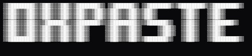
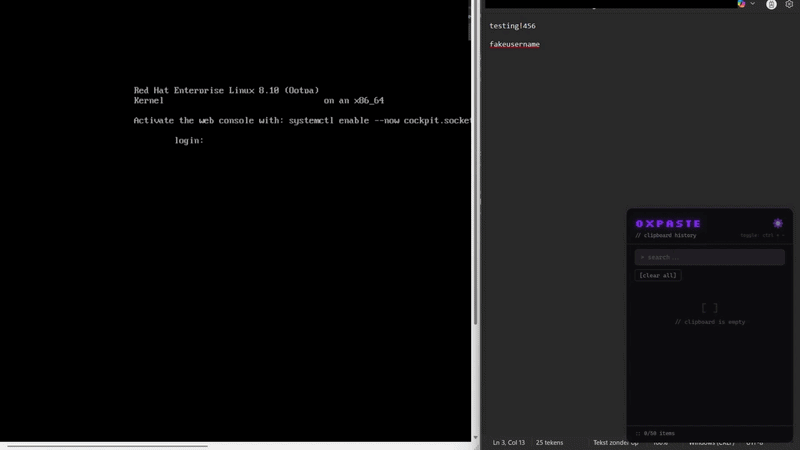
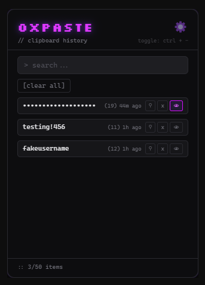
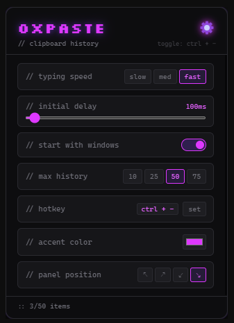

<div align="center">

<br />



**Clipboard history manager for Windows.**
Copy anything. Find it later. Type it anywhere, even where Ctrl+V doesn't work.

<br />


<br />



</div>

---

## What is 0xpaste?

0xpaste is a lightweight clipboard history manager that sits in your Windows system tray and pops up in the corner of your screen with a hotkey. It tracks everything you copy and lets you paste into any text field by clicking or dragging, using PowerShell `SendKeys` to simulate actual keystrokes - no native modules required.

This means it works in places where normal Ctrl+V is blocked: **remote desktop sessions, VMs, browser-based consoles** (vSphere, iDRAC, etc.), and any app that doesn't handle clipboard paste properly.

---

## Features

| | |
|---|---|
| 📋 **Clipboard history** | Auto-tracks everything you copy. Pinned items float to the top, unpinned rotate FIFO. |
| ⌨️ **Click to type** | Click an item, click a target field, and 0xpaste types it out keystroke by keystroke. |
| 🖱️ **Drag to type** | Drag an item directly to any text field on any monitor. |
| 🖥️ **Multi-monitor** | One capture window per display - drop targets work on all screens. |
| 🔍 **Live search** | Instantly filter your history as you type. |
| 📌 **Pin items** | Prevent important items from being rotated out of history. |
| 🔒 **Password masking** | Items that look like passwords are auto-detected and masked by default - shows first 4 chars + blurred dots. Eye icon reveals full text. |
| 🚫 **Typing killswitch** | Move your mouse more than 80px during typing to cancel immediately - works in RDP where keyboard shortcuts are intercepted. |
| ↵ **Auto-type Enter** | Optional setting: automatically sends Enter after every paste - useful for commands. |
| ⚡ **4 typing speeds** | Slow / Med / Fast / X-Fast (7ms per key) with configurable initial delay. |
| ⚙️ **Full settings panel** | All settings accessible from inside the overlay - no separate window needed. |
| 🎨 **Live accent color** | Pick any color - the entire UI including glows, toggles, and borders update instantly. |
| 🖼️ **4 themes** | Default dark, White office, Glass, Dark office. |
| 🚀 **Auto-start** | Optionally launches at Windows startup, always ready in the tray. |
| 📏 **Enforced history limit** | History is strictly capped at your chosen limit - oldest unpinned item removed when full. |

---

## Screenshots

<div align="center">
<table>
<tr>
<td align="center"><b>Clipboard panel</b></td>
<td align="center"><b>Settings</b></td>
</tr>
<tr>
<td></td>
<td></td>
</tr>
</table>
</div>

---

## Installation

### Option A: Download the installer *(recommended)*

Head to [**Releases**](https://github.com/mypetcheetah/0xpaste/releases) and grab the latest `.exe`.

> **Note on security warnings:** Because 0xpaste uses PowerShell `SendKeys` to simulate keystrokes, some antivirus tools may flag it. This is a false positive - the app only types when you explicitly trigger a paste. Add an exclusion in your security software if needed.

### Option B: Build from source

See [Building from Source](#building-from-source) below.

---

## Usage

Once installed, 0xpaste runs in the system tray. Toggle the panel with the hotkey (`Ctrl + Space` by default).

### Panel controls

| Action | How |
|--------|-----|
| **Type an item** | Click the card, then click the target field |
| **Drag an item** | Hold and drag the card to any text field on any monitor |
| **Cancel typing** | Move your mouse more than 80px - works locally and in RDP |
| **Pin / unpin** | Click `⚲` on the card |
| **Reveal / mask** | Click `👁` on the card (passwords auto-masked on detection) |
| **Delete item** | Click `x` on the card |
| **Clear history** | Click `[clear all]`, confirm with second click |
| **Search** | Type in the search bar at the top |
| **Open settings** | Click the gear icon in the top-right of the panel |

### After pasting

The panel **stays open** after typing so you can immediately paste the next item.

---

## Settings Reference

Open settings by clicking the gear icon inside the overlay.

| Setting | Options | Default | What it does |
|---------|---------|---------|--------------|
| **Typing speed** | Slow / Med / Fast / X-Fast | X-Fast | Delay between keystrokes: 100ms / 50ms / 15ms / 7ms |
| **Initial delay** | 0 – 4000ms slider | 25ms | Wait before first keystroke - gives you time to focus the target field |
| **Auto type Enter** | Toggle | Off | Automatically sends Enter after every paste |
| **Start with Windows** | Toggle | On | Launch 0xpaste automatically at login |
| **Max history** | 10 / 25 / 50 / 75 | 25 | Items kept in history - oldest unpinned removed when full |
| **Hotkey** | Any combo with modifier | `Ctrl + Space` | Press `set` then your desired key combo |
| **Accent color** | Color picker | `#7C3AED` | Primary UI color - all elements including glows update live |
| **Panel position** | ↖ ↗ ↙ ↘ | ↘ | Corner of the primary display to snap to |
| **Theme** | Default / White / Glass / Dark | Default | Visual theme for the panel |

Settings are stored in `%APPDATA%\0xpaste\config.json`.

---

## Password Masking

0xpaste automatically scores each copied item using a heuristic system to detect passwords:

- **Instant disqualifiers:** contains spaces, is a URL, email, or file path
- **Positive signals:** mixed case, digits, special characters (`@!#$%`), high Shannon entropy, patterns like `Admin123!`
- **Negative signals:** all lowercase letters, all digits, low entropy

Items scoring **40+** out of 100 are masked by default - showing the first 4 characters followed by blurred dots. Click the 👁 eye icon to reveal or re-mask at any time.

---

## Typing Killswitch

During an active type operation, **move your mouse more than 80px** from the drop point to cancel immediately. This works universally - including inside full-screen RDP sessions where keyboard shortcuts like `Escape` are intercepted by the remote desktop client.

A hint `"Move your mouse to cancel typing."` is always visible at the bottom of the panel as a reminder.

---

## Building from Source

**Requirements**
- Windows 10/11 x64
- [Node.js](https://nodejs.org/) 18 or later
- npm (comes with Node)

**Steps**

```bash
# 1. Clone
git clone https://github.com/mypetcheetah/0xpaste.git
cd 0xpaste

# 2. Install dependencies
npm install

# 3. Generate app icon + download fonts
npm run setup

# 4. Run in development
npm start

# 5. Build installer
npm run dist
```

The installer outputs to `dist/0xpaste Setup 1.0.5.exe`.

> **Run `npm start` from PowerShell or cmd.exe, not Git Bash.**
> In Git Bash/MSYS2, `require('electron')` resolves the npm package path instead of the binary.

---

## Project Structure

```
0xpaste/
├── src/
│   ├── main/
│   │   ├── main.js               # App entry, window management, IPC
│   │   ├── clipboard-monitor.js  # Polls clipboard every 500ms, scores passwords
│   │   ├── typing-engine.js      # PowerShell SendKeys implementation
│   │   ├── hotkey.js             # globalShortcut management
│   │   ├── settings-store.js     # electron-store schema + helpers
│   │   └── tray.js               # System tray icon + context menu
│   ├── passwordDetector.js       # Password scoring heuristics
│   ├── preload/
│   │   ├── preload.js            # Overlay IPC bridge
│   │   ├── capture-preload.js    # Capture window IPC bridge
│   │   └── settings-preload.js   # Settings window IPC bridge
│   └── renderer/
│       ├── overlay/              # Main panel UI (history, search, inline settings)
│       └── capture/              # Fullscreen transparent drop target
├── scripts/
│   ├── generate-icon.js          # Converts root icon.png to ICO (multi-res)
│   └── download-fonts.js         # Downloads Silkscreen font from Google Fonts
├── build/
│   └── installer.nsh             # NSIS custom installer (WOW64-aware cleanup)
└── icon.png                      # Source app icon
```

---

## How the Typing Engine Works

Instead of using Ctrl+V (which doesn't work in RDP/VM consoles), 0xpaste uses a PowerShell subprocess that uses `[System.Windows.Forms.SendKeys]` to simulate keystrokes character by character.

The flow for a click-to-type operation:
1. User clicks a card - overlay hides
2. A fullscreen transparent capture window appears on every monitor
3. User clicks a target field
4. Main process reads `getCursorScreenPoint()` (DIP coords) → converts via `dipToScreenPoint()` (physical pixels)
5. PowerShell moves the cursor, clicks, and types the text keystroke by keystroke
6. Mouse movement monitor runs in parallel - if mouse moves >80px, the PowerShell process is killed immediately

---

## Tech Stack

- **[Electron 26](https://www.electronjs.org/)** - cross-process app shell
- **[electron-store](https://github.com/sindresorhus/electron-store)** - JSON settings with schema validation
- **[nanoid](https://github.com/ai/nanoid)** - unique IDs for clipboard items
- **PowerShell + SendKeys** - keystroke simulation, no native modules or build tools needed
- **NSIS** - Windows installer with WOW64-aware process cleanup
- **Vanilla HTML/CSS/JS** - no frontend framework, no build step for the UI

---

## License

[MIT](LICENSE)

---

<div align="center">
  <sub>Built by <a href="https://github.com/mypetcheetah">mypetcheetah</a></sub>
</div>
