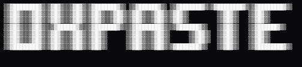
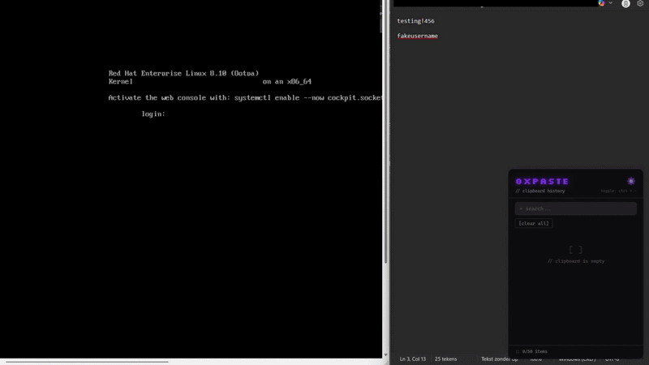
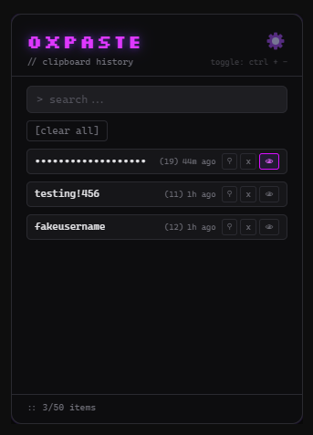
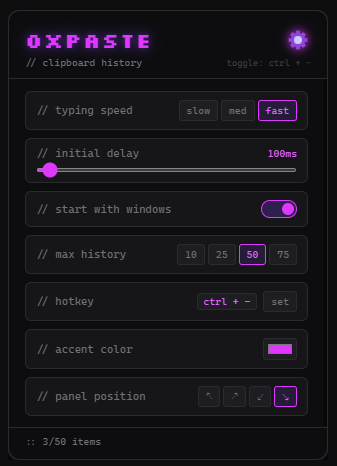

<div align="center">

<br />



**Clipboard history manager for Windows.**
Copy anything. Find it later. Type it anywhere, even where Ctrl+V doesn't work.

<br />


<br />



</div>

---

## What is 0xpaste?

0xpaste is a lightweight clipboard history manager that lives as a thin bar against the left edge of your screen. Hover the bar and the panel slides out; move away and it tucks itself back. No hotkey to remember, nothing in your way. It tracks everything you copy and lets you paste into any text field by clicking or dragging, using PowerShell `SendKeys` to simulate actual keystrokes - no native modules required.

This means it works in places where normal Ctrl+V is blocked: **remote desktop sessions, VMs, browser-based consoles** (vSphere, iDRAC, etc.), and any app that doesn't handle clipboard paste properly.

---

## Features

| | |
|---|---|
| 🪄 **Hover to open** | A slim bar sits at the left edge of your screen. Hover it and the panel slides out; move off and it slides back. While collapsed it is completely click-through - everything underneath stays clickable. |
| 🖥️ **Pick your monitors** | Choose exactly which screens carry the bar, one or all of them. Each gets its own panel, all sharing the same history. |
| 📋 **Clipboard history** | Auto-tracks everything you copy. Pinned items float to the top, unpinned rotate FIFO. |
| ⌨️ **Click to type** | Click an item, click a target field, and 0xpaste types it out keystroke by keystroke. |
| 🖱️ **Drag to type** | Drag an item directly to any text field on any monitor. |
| 🎯 **Drop anywhere** | One capture window per display - drop targets work on all screens. |
| 📌 **Pin the panel** | `[pin]` keeps the panel open while you work in it, so the colour picker and sliders cannot close it by accident. |
| 🔍 **Live search** | Instantly filter your history as you type. |
| 📌 **Pin items** | Prevent important items from being rotated out of history. |
| 🔒 **Password masking** | Items that look like passwords are auto-detected and masked by default - shows first 4 chars + blurred dots. Eye icon reveals full text. |
| 🚫 **Typing killswitch** | Move your mouse more than 80px during typing to cancel immediately - works in RDP where keyboard shortcuts are intercepted. |
| ↵ **Auto-type Enter** | Off: the paste stays on one line and Enter is never pressed - safe in chat apps. On: line breaks become real Enters, plus one after the last character. |
| ⚡ **Adjustable speed** | Sliders for keystroke delay and initial delay (1-4000ms). Drag the speed slider all the way down for **turbo**, which drops the pause between keystrokes entirely - roughly ten times faster than the old fastest setting, because Windows rounds any non-zero pause up to a timer tick of about 15ms. |
| ⬆ **Update notification** | Checks GitHub on start and shows an in-app banner plus a tray entry, but only when a newer stable release actually exists. |
| ⚙️ **Full settings panel** | All settings accessible from inside the overlay - no separate window needed. |
| 🎨 **Live accent color** | Pick any color - the entire UI including glows, toggles, and borders update instantly. |
| 🖼️ **4 themes** | Default dark, White office, Glass, Dark office. |
| 🚀 **Auto-start** | Optionally launches at Windows startup, always ready in the tray. |
| 📏 **Enforced history limit** | History is strictly capped at your chosen limit - oldest unpinned item removed when full. |

---

## Screenshots

<div align="center">
<table>
<tr>
<td align="center"><b>Clipboard panel</b></td>
<td align="center"><b>Settings</b></td>
</tr>
<tr>
<td></td>
<td></td>
</tr>
</table>
</div>

---

## Installation

### Option A: Download the installer *(recommended)*

Head to [**Releases**](https://github.com/mypetcheetah/0xpaste/releases) and grab the latest `.exe`.

> **Note on security warnings:** Because 0xpaste uses PowerShell `SendKeys` to simulate keystrokes, some antivirus tools may flag it. This is a false positive - the app only types when you explicitly trigger a paste. Add an exclusion in your security software if needed.

### Option B: Build from source

See [Building from Source](#building-from-source) below.

---

## Usage

Once installed, 0xpaste runs in the system tray and parks a thin bar against the left edge of your screen.

**Move your mouse onto the bar and the panel slides open. Move away and it closes again.** That is the whole interaction - there is no keyboard shortcut to learn.

While the panel is closed the window is click-through, so the bar never intercepts a click meant for whatever is underneath it. Don't want the bar at all for a while? Left-click the tray icon to hide it, and again to bring it back.

### Panel controls

| Action | How |
|--------|-----|
| **Type an item** | Click the card, then click the target field |
| **Drag an item** | Hold and drag the card to any text field on any monitor |
| **Cancel typing** | Move your mouse more than 80px - works locally and in RDP |
| **Pin / unpin** | Click `⚲` on the card |
| **Reveal / mask** | Click `👁` on the card (passwords auto-masked on detection) |
| **Delete item** | Click `x` on the card |
| **Clear history** | Click `[clear all]`, confirm with second click |
| **Search** | Type in the search bar at the top |
| **Open settings** | Click the gear icon in the top-right of the panel |
| **Keep it open** | Click `[pin]` - the panel then stays out until you click it again |
| **Hide the bar** | Left-click the tray icon (or tray menu -> Hide bar) |

### After pasting

The bar comes straight back, collapsed. Your cursor is sitting in the target window at that point, so an open panel would only be in the way - one flick to the left edge and you are ready for the next paste.

---

## Settings Reference

Open settings by clicking the gear icon inside the panel. Settings changes apply to every monitor's panel at once.

| Setting | Options | Default | What it does |
|---------|---------|---------|--------------|
| **Typing speed** | turbo, or 1 – 150ms | 1ms | Pause between keystrokes. `turbo` (slider fully left) removes the pause altogether: much faster, but a slow remote console may not keep up. Anything above 0 is rounded up by Windows to roughly 15ms. |
| **Initial delay** | 1 – 4000ms slider + exact field | 1ms | Wait after clicking the target, before the first keystroke |
| **Auto type Enter** | Toggle | Off | Off: everything on one line, Enter is never pressed. On: line breaks become Enters, plus one at the end |
| **Start with Windows** | Toggle | On | Launch 0xpaste automatically at login |
| **Max history** | 10 / 25 / 50 / 75 | 50 | Items kept in history - oldest unpinned removed when full |
| **Show bar on** | One row per detected monitor | Primary only | Which screens carry the bar. At least one stays selected. |
| **Accent color** | Color picker | `#7C3AED` | Primary UI color - all elements including glows update live |
| **Theme** | Default / White / Glass / Dark | Default | Visual theme for the panel |

Settings are stored in `%APPDATA%\0xpaste\config.json`.

---

## Password Masking

0xpaste automatically scores each copied item using a heuristic system to detect passwords:

- **Instant disqualifiers:** contains spaces, is a URL, email, or file path
- **Positive signals:** mixed case, digits, special characters (`@!#$%`), high Shannon entropy, patterns like `Admin123!`
- **Negative signals:** all lowercase letters, all digits, low entropy

Items scoring **40+** out of 100 are masked by default - showing the first 4 characters followed by blurred dots. Click the 👁 eye icon to reveal or re-mask at any time.

---

## Typing Killswitch

During an active type operation, **move your mouse more than 80px** from the drop point to cancel immediately. This works universally - including inside full-screen RDP sessions where keyboard shortcuts like `Escape` are intercepted by the remote desktop client.

A hint `"Move your mouse to cancel typing."` is always visible at the bottom of the panel as a reminder.

---

## Building from Source

**Requirements**
- Windows 10/11 x64
- [Node.js](https://nodejs.org/) 18 or later
- npm (comes with Node)

**Steps**

```bash
# 1. Clone
git clone https://github.com/mypetcheetah/0xpaste.git
cd 0xpaste

# 2. Install dependencies
npm install

# 3. Generate app icon + download fonts
npm run setup

# 4. Run in development
npm start

# 5. Build installer
npm run dist
```

The installer outputs to `dist/0xpaste Setup 1.1.0.exe`.

> **Run `npm start` from PowerShell or cmd.exe, not Git Bash.**
> In Git Bash/MSYS2, `require('electron')` resolves the npm package path instead of the binary.

---

## Project Structure

```
0xpaste/
├── src/
│   ├── main/
│   │   ├── main.js               # App entry, window management, IPC
│   │   ├── clipboard-monitor.js  # Polls clipboard every 500ms, scores passwords
│   │   ├── typing-engine.js      # PowerShell SendKeys implementation
│   │   ├── escape-key.js         # Escape handling while the drop overlay is up
│   │   ├── settings-store.js     # electron-store schema + helpers
│   │   └── tray.js               # System tray icon + context menu
│   ├── passwordDetector.js       # Password scoring heuristics
│   ├── shared/
│   │   └── dock-geometry.js      # Bar/panel dimensions shared by main + renderer
│   ├── preload/
│   │   ├── preload.js            # Dock panel IPC bridge
│   │   └── capture-preload.js    # Capture window IPC bridge
│   └── renderer/
│       ├── overlay/              # Dock panel UI (history, search, inline settings)
│       └── capture/              # Fullscreen transparent drop target
├── scripts/
│   ├── generate-icon.js          # Renders assets/icon.svg to PNG + multi-res ICO
│   └── download-fonts.js         # Downloads Silkscreen font from Google Fonts
├── build/
│   └── installer.nsh             # NSIS custom installer (WOW64-aware cleanup)
└── assets/
    └── icon.svg                  # Source app icon - every raster icon comes from this
```

---

## How the Typing Engine Works

Instead of using Ctrl+V (which doesn't work in RDP/VM consoles), 0xpaste uses a PowerShell subprocess that uses `[System.Windows.Forms.SendKeys]` to simulate keystrokes character by character.

The flow for a click-to-type operation:
1. User clicks a card - overlay hides
2. A fullscreen transparent capture window appears on every monitor
3. User clicks a target field
4. Main process reads `getCursorScreenPoint()` (DIP coords) → converts via `dipToScreenPoint()` (physical pixels)
5. PowerShell moves the cursor, clicks, and types the text keystroke by keystroke
6. Mouse movement monitor runs in parallel - if mouse moves >80px, the PowerShell process is killed immediately

### Special characters and dead keys

On Dutch and other EU keyboard layouts, `^` `` ` `` `'` `~` `"` are *dead keys*: pressing one produces nothing until the next key, which it then tries to combine with. Typed naively, `^e` silently becomes `ê` and the standalone accent disappears.

0xpaste resolves each dead key immediately by sending the character, then a **digit**, then a backspace. A digit shares no accent combination with any dead key, so Windows always emits both the standalone accent and the digit; the backspace then removes only the digit. A space cannot be used here: on a real dead-key layout the accent swallows the space, after which the backspace eats the accent itself and the character vanishes.

The result is identical output on a plain layout and on a dead-key layout, in local apps and in browser-based VM consoles alike. All 94 printable ASCII characters type through 1:1.

> Keystrokes deliberately go through `SendKeys`, which lives inside a Microsoft-signed .NET assembly. Injecting raw `SendInput` keystrokes from runtime-compiled code reads as a keylogger pattern to endpoint security tools and gets flagged; the `SendKeys` route does not.

---

## Tech Stack

- **[Electron 26](https://www.electronjs.org/)** - cross-process app shell
- **[electron-store](https://github.com/sindresorhus/electron-store)** - JSON settings with schema validation
- **[nanoid](https://github.com/ai/nanoid)** - unique IDs for clipboard items
- **PowerShell + SendKeys** - keystroke simulation, no native modules or build tools needed
- **NSIS** - Windows installer with WOW64-aware process cleanup
- **Vanilla HTML/CSS/JS** - no frontend framework, no build step for the UI

---

## License

[MIT](LICENSE)

---

<div align="center">
  <sub>Built by <a href="https://github.com/mypetcheetah">mypetcheetah</a></sub>
</div>
